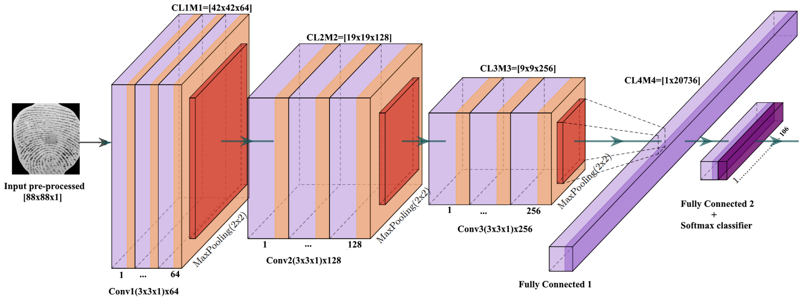

# Facial Expression Recognition Model

This model can detect 7 besic human facial expressions, and it's bulid on tensorflow keras library. this modle can work on your camera and also recorded 
videos.outputs displayed on web browser `localhost:5000`.

- happy
- sad
- angry
- neutral
- fear
- surprise
- disgust

A Convolutional Neural Network (ConvNet/CNN) is a Deep Learning algorithm which can take in an input image, assign importance (learnable weights and biases) to various aspects/objects in the image and be able to differentiate one from the other. The pre-processing required in a CNN is much lower as compared to other classification algorithms. While in primitive methods filters are hand-engineered, with enough training, CNNs have the ability to learn these filters/characteristics.

The architecture of a CNN is analogous to that of the connectivity pattern of Neurons in the Human Brain and was inspired by the organization of the Visual Cortex. Individual neurons respond to stimuli only in a restricted region of the visual field known as the Receptive Field. A collection of such fields overlap to cover the entire visual area.

## Demo
   
   
   

## Installation and Testing

To test this model you have to install `python 3` and these libreries on you test machine,
`flask`, `tensorflow`, `numpy`, `openCV`
After complete installations direct CMD to project folder and run `main.py`

### on windows

`D:\prject>py -3 main.py`
Then open browser and type `localhost:5000`
if need to run this model on device camera change the path to `0` in VideoCamera class in `camera.py`

## Dataset
Dataset to train the model from Kaggle.com
link: [facial expression recognition challenge](https://www.kaggle.com/c/challenges-in-representation-learning-facial-expression-recognition-challenge/rules)

